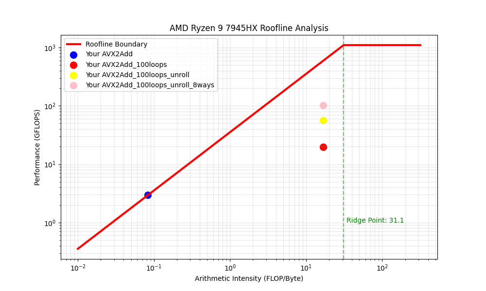

探究SIMD性能的简单实验

平台
Ubuntu 24.04
AMD Ryzen 9 7945HX
64GB (DDR5)

编译指令
``` bash
g++ -O3 -mavx2 hello_SIMD.cpp -o hello_SIMD && perf stat -e cycles,instructions,cache-misses ./hello_SIMD
```

测试结果
| 测试版本             | 算术强度 (AI) | 运行耗时 (Avg) | 实际性能 (GFLOPS) | IPC (指令效率) | 加速比 (vs Scalar) |
| -------------------- | ------------- | -------------- | ----------------- | -------------- | ------------------ |
| 1. 标量基础 (Scalar) | 0.083         | 7947.95 us     | 2.52              | 0.78           | 1.0x               |
| 2. 基础 AVX2         | 0.083         | 6,746 μs       | 2.96              | 0.77           | 1.18x              |
|                      |               |                |                   |                |                    |
| Scalar 100次循环     | 0.083         | 1,595,123 μs   | 2.51              | 0.96           | 1.0x               |
| AVX2 + 100次循环     | 16.67         | 204,240 μs     | 19.59             | 0.94           | 7.76x              |
| AVX2 + 4路并行       | 16.67         | 70,581 μs      | 56.67             | 0.99           | 23.09x             |
| AVX2 + 8路并行       | 16.67         | 39,294 μs      | 101.8             | 2.77           | 40.59x             |

